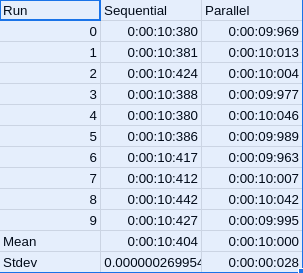

= Exercise 03
:author: Florian Weingartshofer
:email: <S1910307103@students.fh-hagenberg.at>
:reproducible:
:experimental:
:listing-caption: Listing
:source-highlighter: rouge
:rouge-style: github
:toc:
:sectnums:
:sectnumlevels: 6
:toclevels: 6
// Variables
:img: ./img
:imagesoutdir: ./out

<<<

== Simple Mandelbrotgenerator
This implementation was finished during the exercise.

[source,csharp]
----
include::../MandelbrotGenerator/SyncImageGenerator.cs[]
----

== Asynchronous Image Generation
The first solution was also implemented during the exercise.

.AsyncThreadImageGenerator
[source,csharp]
----
include::../MandelbrotGenerator/AsyncThreadImageGenerator.cs[]
----

Another ImageGenerator was implemented using a BackgroundWorker.
A problem was that the BackgroundWorker could not be cancelled and started again, so it is just re-instantiated.
To cancel a backgroundWorker the `CancelAsync` method is used.

.BackgroundWorkerImageGenerator
[source,csharp]
----
include::../MandelbrotGenerator/BackgroundWorkerImageGenerator.cs[]
----

== Partition the Work
The area is partitioned according to the number of available workers.
The underlying implementation uses threads to generate the different parts of the image.
The image is split into columns, and then merged after each thread is done generating the image.
For synchronization a cancellationToken is used and each thread saves its part into a bitmap array, which is merged into one bitmap, after all threads are done.

.PartitionedImageGenerator
[source,csharp]
----
include::../MandelbrotGenerator/PartitionedImageGenerator.cs[]
----

== Tests
Ten independent testruns with the following settings:
[source,csharp]
----
public Settings() {
    MinReal = -1.4; 
    MinImg = -0.1;
    MaxReal = -1.32; 
    MaxImg = -0.02;
    maxIterations = 10000;
    zBorder = 4.0;
    workers = 2;
}
----

.Testruns

