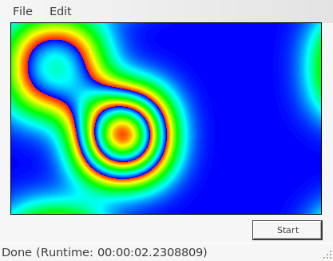
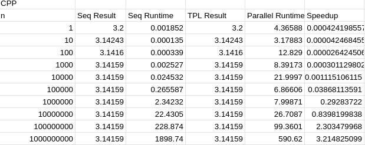
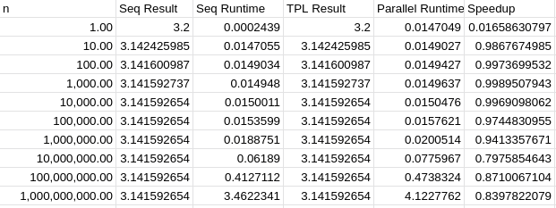

= Exercise 04
Florian Weingartshofer <S1910307103@fhooe.at>
:reproducible:
:experimental:
:listing-caption: Listing
:source-highlighter: rouge
:rouge-style: github
:toc:
:sectnums:
:sectnumlevels: 6
:toclevels: 6
// Variables
:img: ./img
:imagesoutdir: ./out

== Psychedelic Diffusions
Um die UI responsiv zu machen wurde in der Start-Methode des ImageGenerators alles in einem `Task.Run` verpackt und ein CancelationToken wird genutzt um die Berechnungen abzubrechen.

.ImageGenerator
[source,csharp]
----
include::../Diffusions/ImageGenerator.cs[]
----

=== Parallelization
Die Parallelisierung wurde mit `Parallel.ForEach` und `Partitioner` erzielt.
Dabei wurde die Matrix in die Spalten partitioniert.
Damit kann die Matrix in kleinere Arbeitspakete aufgeteilt werden.

.ParallelImageGenerator
[source,csharp]
----
include::../Diffusions/ParallelImageGenerator.cs[]
----

=== Speed-Up
Speed-Up = `3.049 / 2.23 = 1.367264574`

.Parallel Diffusion

.Sequential Diffusion

== Parallel Numerical Integration
=== CPP
Wurde in der Übung mithilfe von OpenMP und for reduce implementiert.

.Integration with C++ and OpenMP
[source,cpp]
----
include::../ParallelNumericalIntegration_OpenMP/main.cpp[]
----

Beim Ausführen kommen folgende Werte heraus.

Man kann deutlich sehen, dass bei einem höheren `n` die parallele Variante wesentlich schneller ist und ein ein Speedup von bis zu `3.21` erziehlt wird.

.OpenMP

Allerding ist dem nicht so bei der TPL, oder zumindest auf meinem Rechner, da hier die TPL konsistent langsamer als die sequentielle Variante ist. 
Ein Grund dafür könnte sein, dass das Ganze auf Linux ausgeführt wird, 
allerdings konnte ich dafür keine Quellen online finden.

.Specs
|===

|CPU |Intel I7 8 Cores

|Ram |16 GB

|OS | PopOs 21.10
|===

.Integration with C# and TPL

*By the way, do you notice something concerning the value of the computed integral?* +
Die Werte bleiben nach ca 10.000 Iterationen gleich.

