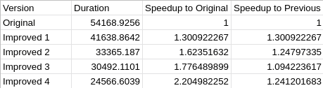

= Exercise 05
:author: Florian Weingartshofer 
:email: <S1910307103@fhooe.at>
:reproducible:
:experimental:
:listing-caption: Listing
:source-highlighter: rouge
:rouge-style: github
:toc:
:sectnums:
:sectnumlevels: 6
:toclevels: 6
// Variables
:img: ./img
:imagesoutdir: ./out

<<<
== Stock Visualization
An asynchronous implementation of the stock visualization.
Most of the work has been done during the lecture.

.Sequential
[source,csharp]
----
include::../Quandl.UI/QuandlViewer.cs[lines=32..46]
----

<<<
=== With TPL

.TPL
[source,csharp]
----
include::../Quandl.UI/QuandlViewer.cs[lines=89..115]
----

<<<
=== With async/await
The async/await version is shorter than the TPL approach.

.async/await
[source,csharp]
----
include::../Quandl.UI/QuandlViewer.cs[lines=117..134]
----

<<<
== Wator World
=== Approach
The matrix of wator world is divided into multiple parts, this can be done with an partitioner.
To prevent race conditions every even partition is executed first and then the odd partitions.

.Partitioning the matrix
[source,csharp]
----
include::../Wator/Improved4/Improved4WaterWorld.cs[lines=91..91]
----

The matrix randomization algorithm implements two new parameters for upper and lower bounds.

[source,csharp]
----
include::../Wator/Improved4/Improved4WaterWorld.cs[lines=294..303]
----

Last each partition is executed.

[source,csharp]
----
include::../Wator/Improved4/Improved4WaterWorld.cs[lines=97..146]
----

*Advantages*

- Simple by using async/await
- Really fast, two times faster than the original

*Disadvantages*

- Not the whole matrix gets randomized, but only parts of it, since each partition gets randomized

=== Comparison

.Improved 4(async) Comparison

