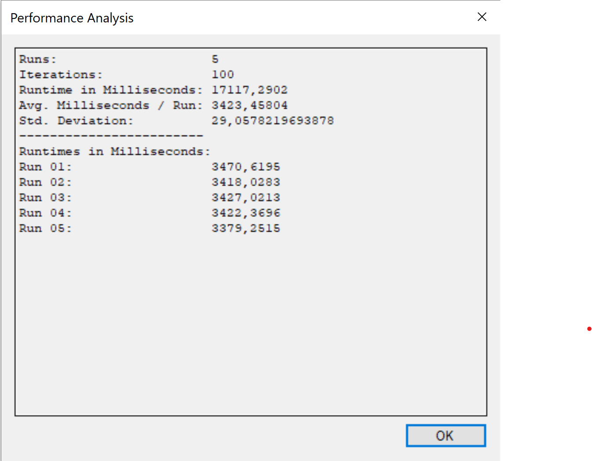

= Exercise 01
:author: Florian Weingartshofer
:email: <S1910307103@students.fh-hagenberg.at>
:reproducible:
:experimental:
:listing-caption: Listing
:source-highlighter: rouge
:rouge-style: github
:toc:
:sectnums:
:sectnumlevels: 6
:toclevels: 6
// Variables
:img: ./img
:imagesoutdir: ./out

== 01

== 02
=== a

=== b
.Before any improvments
image::./img/before-improvments.png[]
==== 1. Improvment

[source,csharp]
----
private readonly List<Point> neighbors = new List<Point>(4);
// find all neighboring cells of the given position and type
public Point[] GetNeighbors(Type type, Point position)
{
    neighbors.Clear();
    int neighborIndex = 0;
    int i, j;

    // look north
    i = position.X;
    j = (position.Y + Height - 1) % Height;
    if ((type == null) && (Grid[i, j] == null))
    {
        neighbors.Add(new Point(i, j));
        neighborIndex++;
    }
    else if ((type != null) && (type.IsInstanceOfType(Grid[i, j])))
    {
        if ((Grid[i, j] != null) && (!Grid[i, j].Moved))
        {  // ignore animals moved in the current iteration
            neighbors.Add(new Point(i, j));
            neighborIndex++;
        }
    }
    // look east
    i = (position.X + 1) % Width;
    j = position.Y;
    if ((type == null) && (Grid[i, j] == null))
    {
        neighbors.Add(new Point(i, j));
        neighborIndex++;
    }
    else if ((type != null) && (type.IsInstanceOfType(Grid[i, j])))
    {
        if ((Grid[i, j] != null) && (!Grid[i, j].Moved))
        {
            neighbors.Add(new Point(i, j));
            neighborIndex++;
        }
    }
    // look south
    i = position.X;
    j = (position.Y + 1) % Height;
    if ((type == null) && (Grid[i, j] == null))
    {
        neighbors.Add(new Point(i, j));
        neighborIndex++;
    }
    else if ((type != null) && (type.IsInstanceOfType(Grid[i, j])))
    {
        if ((Grid[i, j] != null) && (!Grid[i, j].Moved))
        {
            neighbors.Add(new Point(i, j));
            neighborIndex++;
        }
    }
    // look west
    i = (position.X + Width - 1) % Width;
    j = position.Y;
    if ((type == null) && (Grid[i, j] == null))
    {
        neighbors.Add(new Point(i, j));
        neighborIndex++;
    }
    else if ((type != null) && (type.IsInstanceOfType(Grid[i, j])))
    {
        if ((Grid[i, j] != null) && (!Grid[i, j].Moved))
        {
            neighbors.Add(new Point(i, j));
            neighborIndex++;
        }
    }

    // create result array that only contains found cells
    //Point[] result = new Point[neighborIndex];
    //Array.Copy(neighbors.ToArray(), result, neighborIndex);
    return neighbors.ToArray();
}
----

.Improvment 1

