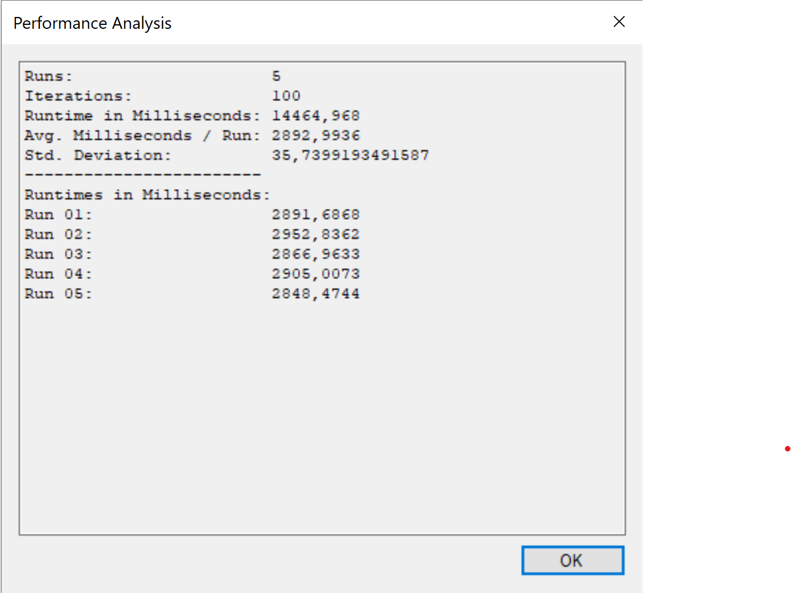
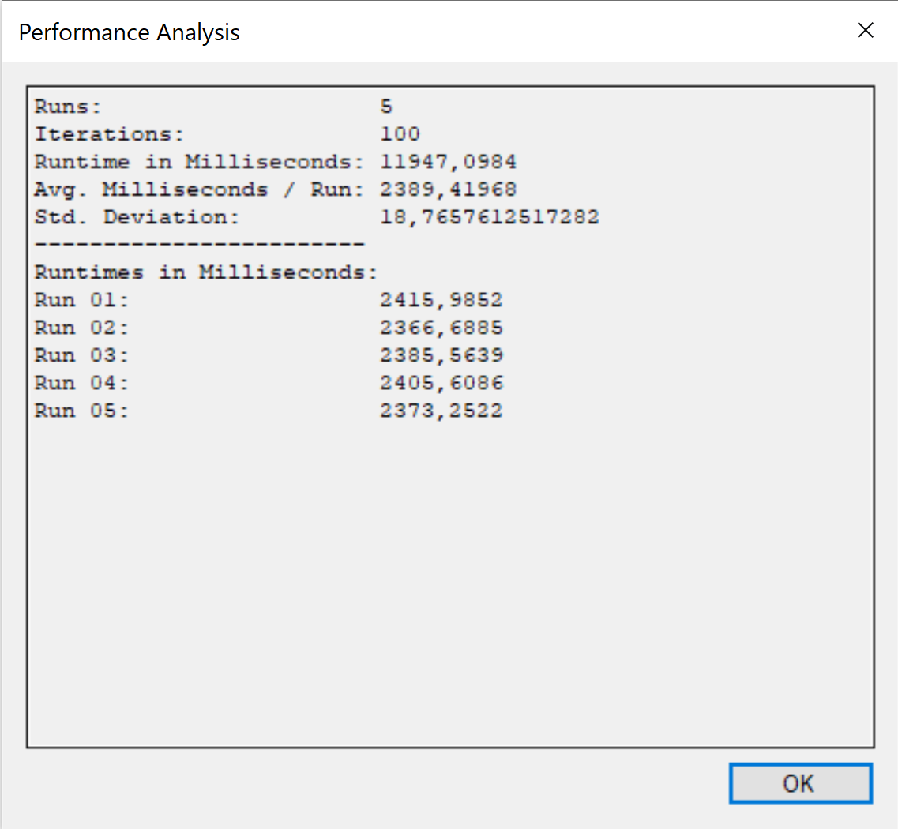

= Exercise 01
:author: Florian Weingartshofer
:email: <S1910307103@students.fh-hagenberg.at>
:reproducible:
:experimental:
:listing-caption: Listing
:source-highlighter: rouge
:rouge-style: github
:toc:
:sectnums:
:sectnumlevels: 6
:toclevels: 6
// Variables
:img: ./img
:imagesoutdir: ./out

== 01

== 02
=== a

=== b
.Before any improvments

==== 1. Improvment
Instead of creating the neighbors array everytime the method is called, its made a list and a member of the class WatorWorld.
Therefore, the workload on the garbage collector is reduced, and the array isn't recreated everytime the method is called.
[source,csharp]
----
private readonly List<Point> neighbors = new List<Point>(4);
// find all neighboring cells of the given position and type
public List<Point> GetNeighbors(Type type, Point position)
{
    //Point[] neighbors = new Point[4];
    neighbors.Clear();
    int neighborIndex = 0;
    int i, j;

    // look north
    i = position.X;
    j = (position.Y + Height - 1) % Height;
    if ((type == null) && (Grid[i, j] == null))
    {
        neighbors.Add( new Point(i, j));
        neighborIndex++;
    }
    else if ((type != null) && (type.IsInstanceOfType(Grid[i, j])))
    {
        if ((Grid[i, j] != null) && (!Grid[i, j].Moved))
        {  // ignore animals moved in the current iteration
            neighbors.Add(new Point(i, j));
            neighborIndex++;
        }
    }
    // look east
    i = (position.X + 1) % Width;
    j = position.Y;
    if ((type == null) && (Grid[i, j] == null))
    {
        neighbors.Add(new Point(i, j));
        neighborIndex++;
    }
    else if ((type != null) && (type.IsInstanceOfType(Grid[i, j])))
    {
        if ((Grid[i, j] != null) && (!Grid[i, j].Moved))
        {
            neighbors.Add(new Point(i, j));
            neighborIndex++;
        }
    }
    // look south
    i = position.X;
    j = (position.Y + 1) % Height;
    if ((type == null) && (Grid[i, j] == null))
    {
        neighbors.Add(new Point(i, j));
        neighborIndex++;
    }
    else if ((type != null) && (type.IsInstanceOfType(Grid[i, j])))
    {
        if ((Grid[i, j] != null) && (!Grid[i, j].Moved))
        {
            neighbors.Add(new Point(i, j));
            neighborIndex++;
        }
    }
    // look west
    i = (position.X + Width - 1) % Width;
    j = position.Y;
    if ((type == null) && (Grid[i, j] == null))
    {
        neighbors.Add(new Point(i, j));
        neighborIndex++;
    }
    else if ((type != null) && (type.IsInstanceOfType(Grid[i, j])))
    {
        if ((Grid[i, j] != null) && (!Grid[i, j].Moved))
        {
            neighbors.Add(new Point(i, j));
            neighborIndex++;
        }
    }

    // create result array that only contains found cells
    //Point[] result = new Point[neighborIndex];
    //Array.Copy(neighbors, result, neighborIndex);
    return neighbors;
}

// select a random neighboring cell of the given position and type
public Point SelectNeighbor(Type type, Point position)
{
    List<Point> neighbors = GetNeighbors(type, position);  // find all neighbors of required type
    if (neighbors.Count > 1)
    {
        return neighbors[random.Next(neighbors.Count)];  // return random neighbor (prevent bias)
    }
    else if (neighbors.Count == 1)
    {  // only one neighbor -> return without calling random
        return neighbors[0];
    }
    else
    {
        return new Point(-1, -1);  // no neighbor found
    }
}
----

.Improvement 1

=== 2. Improvement
Convert all 2d Arrays to a one dimensional array.
So instead of using `Grid[i, j]` it's `Grid[i + j * Width]`

[source,csharp]
----
private int[] randomMatrix;
public Animal[] Grid { get; private set; }
Grid = new Animal[Width * Height];
public List<Point> GetNeighbors(Type type, Point position)
{
    //Point[] neighbors = new Point[4];
    neighbors.Clear();
    int neighborIndex = 0;
    int i, j;

    // look north
    i = position.X;
    j = (position.Y + Height - 1) % Height;
    if ((type == null) && (Grid[i + j * Width] == null))
    {
        neighbors.Add( new Point(i, j));
        neighborIndex++;
    }
    else if ((type != null) && (type.IsInstanceOfType(Grid[i + j * Width])))
    {
        if ((Grid[i + j * Width] != null) && (!Grid[i + j * Width].Moved))
        {  // ignore animals moved in the current iteration
            neighbors.Add(new Point(i, j));
            neighborIndex++;
        }
    }
    // look east
    i = (position.X + 1) % Width;
    j = position.Y;
    if ((type == null) && (Grid[i + j * Width] == null))
    {
        neighbors.Add(new Point(i, j));
        neighborIndex++;
    }
    else if ((type != null) && (type.IsInstanceOfType(Grid[i + j * Width])))
    {
        if ((Grid[i + j * Width] != null) && (!Grid[i + j * Width].Moved))
        {
            neighbors.Add(new Point(i, j));
            neighborIndex++;
        }
    }
    // look south
    i = position.X;
    j = (position.Y + 1) % Height;
    if ((type == null) && (Grid[i + j * Width] == null))
    {
        neighbors.Add(new Point(i, j));
        neighborIndex++;
    }
    else if ((type != null) && (type.IsInstanceOfType(Grid[i + j * Width])))
    {
        if ((Grid[i + j * Width] != null) && (!Grid[i + j * Width].Moved))
        {
            neighbors.Add(new Point(i, j));
            neighborIndex++;
        }
    }
    // look west
    i = (position.X + Width - 1) % Width;
    j = position.Y;
    if ((type == null) && (Grid[i + j * Width] == null))
    {
        neighbors.Add(new Point(i, j));
        neighborIndex++;
    }
    else if ((type != null) && (type.IsInstanceOfType(Grid[i + j * Width])))
    {
        if ((Grid[i + j * Width] != null) && (!Grid[i + j * Width].Moved))
        {
            neighbors.Add(new Point(i, j));
            neighborIndex++;
        }
    }

    // create result array that only contains found cells
    //Point[] result = new Point[neighborIndex];
    //Array.Copy(neighbors, result, neighborIndex);
    return neighbors;
}

private int[] GenerateRandomMatrix(int width, int height)
{
    int[] matrix = new int[width * height];

    int row = 0;
    int col = 0;
    for (int i = 0; i < matrix.Length; i++)
    {
        matrix[col+ row * width] = i;
        col++;
        if (col >= width) { col = 0; row++; }
    }
    RandomizeMatrix(matrix);  // shuffle
    return matrix;
}
----

.Improvement 2

=== 3. Improvement
The `RandomizeMatrix` Algorithm is replaced by the standard Knuth Shuffle and the `Shark.Spawn`-Method has been optimized.

[source,csharp]
----
private void RandomizeMatrix(int[] matrix)
{
    int n = matrix.Length;
    for (int i = 0; i < (n - 2); i++)
    {
        int j = random.Next(i, n);
        var tmp = matrix[i];
        matrix[i] = matrix[j];
        matrix[j] = tmp;

    }
}
// Shark.cs
protected override void Spawn()
{
    Point free = World.SelectNeighbor(null, Position);  // find a random empty neighboring cell
    if (free.X != -1)
    {
        // empty neighboring cell found -> create new shark there and share energy between parent and child shark
        Energy /= 2;
        new Shark(World, free, Energy);
    }
}
----

.Improvement 3

